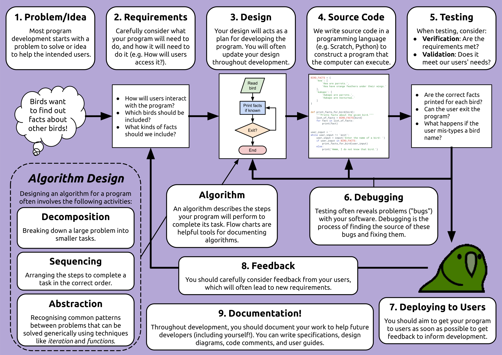

# IT Posters

These posters were produced to introduce various topics in information
technology in a simple way that may be useful for classrooms. Some
posters were inspired by topics covered in
[code.org](https://code.org/).

The posters are available in the following formats:

* [pdf](pdf/) - Best for printing
* [odp](odp/) - Best for editing
* [svg](svg/) - Best for posterity

The posters were originally produced with Google Slides.

**Interested in open-source technical training material? Check out
[TechNoon](https://technoon.org)!**

## Previews

### IT Industry Roles

### Software Development Lifecycle

### IT Thinking Hats

### Digital Data

### Artificial Intelligence and Machine Learning

### Types of Software

### Computer Languages

### Event-Driven Programming

### Programming Language Source Code

### Debugging

### Hardware in a Computer

### Computer Networking

## License

Copyright Benjamin Denham - licensed under
[CC BY-SA 4.0](https://creativecommons.org/licenses/by-sa/4.0/)

### Used assets

* https://commons.wikimedia.org/wiki/File:Kea_on_snow.jpg - released
  to the public domain
* Original "parrot gif" by Geiger Powell, who has
  [given permission for unlimited use and adaptation](https://github.com/jmhobbs/cultofthepartyparrot.com/blob/main/LICENSE).
* Various public domain assets used
* Other logos and screenshots used under fair use for educational
  purposes
